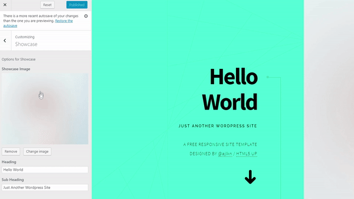

### Paradigm Shift Wordpress Theme

This is a wordpress port of HTML5UP free template - Paradigm Shift - Created by @ajlkn

This theme includes a robust customizer section that allows you to dynamically edit almost every single piece of content of the template inside of the wordpress dashboard.

View live sample [here](http://miikea.sgedu.site)

**To install:**

1. Download the `Paradigm-Shift-WP-master.zip` of from this repository by clicking the 'clone or download' button
2. Open your wordpress installation and navigate to **Appearance > Themes** then **Add New > Upload Theme**
3. Then choose the `Paradigm-Shift-WP-master.zip` and wait for the installer to complete
4. Go back to themes and click on Paradigm Shift and then click **Activate**
5. Enjoy!

**Ported to Wordpress by Mike Arriaga [@ux_Michael](https://twitter.com/ux_Michael)**

LICENSED UNDER CCA 3.0
